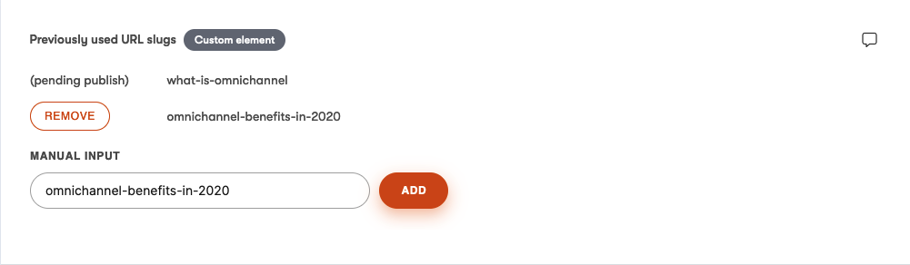

# URL slug history custom element for Kontent.ai

This [custom element](https://kontent.ai/learn/tutorials/develop-apps/integrate/content-editing-extensions) for [Kontent.ai](https://kontent.ai) enables users to preserve history of URL slugs.

The element watches the URL slug element for changes. When the slug changes, the element automatically saves the previous URL slug to a history list. It's also possible to manually add and remove history entries.



## Setup

1. Build the code

```
npm run build
```

1. Deploy the code to a secure public host
    * See the [deploying section](#deploying) for a really quick option

1. Follow the instructions in the [custom elements documentation](https://kontent.ai/learn/tutorials/develop-apps/integrate/content-editing-extensions#a-displaying-your-custom-editor-in-kontent) to add the element to a content model.
    * The `Hosted code URL` is where you've deployed the element to in step 1.
    * Add the URL slug element's codename into configuration.

## Local Development with HTTPS

For local development and testing with Kontent.ai (which requires HTTPS), this project includes SSL certificate generation and HTTPS server support.

### Quick Start

```bash
# First time setup - generate SSL certificates
npm run setup:ssl

# Build and start HTTPS server
npm run dev:https
```

**Note:** If you get "Could not find certificate ssl/cert.pem" error, run `npm run setup:ssl` first.

This will:
1. Generate self-signed SSL certificates (if needed)
2. Build the TypeScript code
3. Start an HTTPS server on port 8443

### Available URLs
- `https://localhost:8443`
- `https://127.0.0.1:8443`

### Available Scripts

- `npm run setup:ssl` - Generate SSL certificates for HTTPS development
- `npm run serve:https` - Start HTTPS server on port 8443
- `npm run dev:https` - Build and start HTTPS server  
- `npm run serve` - Start HTTP server on port 8080
- `npm run dev` - Build with watch mode (for development)
- `npm run build` - Build for production

### SSL Certificate Setup

**Manual SSL Certificate Generation:**

If you prefer to generate certificates manually or the npm script doesn't work:

```bash
# Create ssl directory
mkdir -p ssl

# Generate self-signed certificate and private key
openssl req -x509 -newkey rsa:4096 -keyout ssl/key.pem -out ssl/cert.pem -days 365 -nodes -subj "/C=US/ST=State/L=City/O=Organization/CN=localhost"
```

The SSL certificates will be created in the `ssl/` folder:
- `ssl/cert.pem` - SSL certificate
- `ssl/key.pem` - Private key

**Requirements:**
- OpenSSL must be installed on your system
- On macOS: OpenSSL comes pre-installed
- On Windows: Install via [Git for Windows](https://git-scm.com/download/win) or [OpenSSL for Windows](https://slproweb.com/products/Win32OpenSSL.html)
- On Linux: Install via package manager (`sudo apt-get install openssl` or similar)

**Important:** Your browser will show a security warning for self-signed certificates. Click "Advanced" → "Proceed to localhost" to continue.

### Using with Kontent.ai

1. Start the HTTPS server: `npm run dev:https`
2. In Kontent.ai, use `https://localhost:8443` as your custom element URL
3. Accept the browser security warning when prompted

## Configuration

The custom element may only be used for content types that contain the URL slug element. The configuration of the custom element looks like this:

```
{
    "urlSlugElementCodename": "{codename of the URL slug element}"
}
```
This configuration is required and the custom element won't work without it.

## Deploying

Netlify has made this easy. If you click the deploy button below, it will guide you through the process of deploying the element to Netlify and leave you with a copy of this repository in your GitHub account as well.

[](https://app.netlify.com/start/deploy?repository=https://github.com/ondrabus/kontent-url-slug-history-custom-element)

Don't forget to add `npm run build` to the build command in Netlify settings, so that the TypeScript code is compiled before deployment.

## What is Saved?

The value is an array of strings (old URL slugs).

```
["old-url-slug", "even-older-url-slug"]
```


